# powerbi-macguyver-toolbox
Power BI report .pbip templates and patterns to create special visuals, address specific problems, and have data adventures.

**SVG measure templates contributed by Štěpán Rešl. Thanks Štěpán!**

## ⚠️ Notice
These templates are provided as-is without warranties or guarantees. They are not maintained nor are they all necessarily suitable for use in production solutions.
Feel free to use them, but do so at your own risk.
	
## 💡 To use these templates
You must first enable Power BI Project files from Power BI Desktop to open and use these templates. Note that the .pbip format is in Preview.

1. Open Power BI Desktop (~May 2023 version or later)
2. Open the 'File' menu
3. Navigate to _Options and settings_ and then _Options_
4. Enable the preview feature _Power BI Project (.pbip) save option
5. Restart Power BI Desktop
6. Clone the Repo to your local machine using VS Code or a similar SCM tool
7. Open the .pbip files in Power BI Desktop

- I will make a tutorial about how to do this in a video in the coming week.

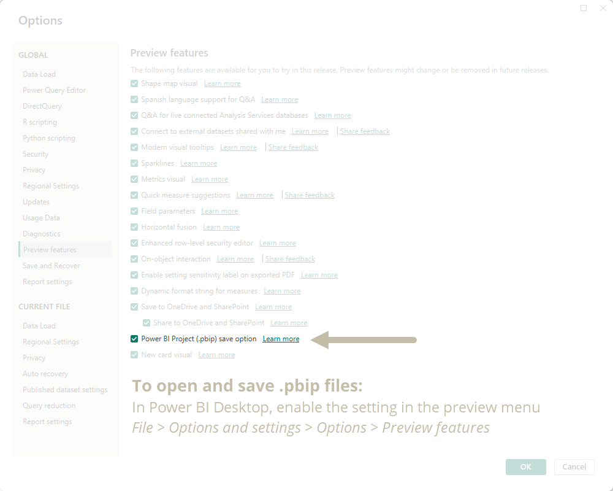

__I use the .pbip format for the following reasons:__
- Lightweight sharing of report + model metadata.
- Report metadata allows you to programmatically modify the templates before opening them.
- Track changes of the individual objects and formatting in the GitHub repo.

## Bar chart templates
The following bar chart templates are available:

_Note: Any chart with a MacGuyver Rating of 3 or above_ (🟩🟩🟩⬜⬜+) _is not recommended for production deployment. That's because they require too many report-specific objects and have too high a risk to break or effort to maintain. For these charts, you should use Deneb._

| Image (Click for Template) | Name | Description |
|:-----:|:----:|:------------|
| <a href="bar-charts/bar-chart/">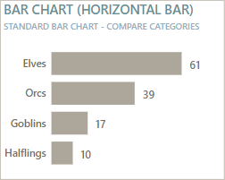</a> | __Bar chart (Horizontal bar)__ | The standard horizontal bar chart. Tried and true, best used to compare categories. Consider turning off axes and gridlines and using data labels with conditional formatting for a more elegant design.    _Subjective Goblin graph scores_  🟩🟩🟩🟩🟩 __Popularity Rating__ - Frequency I see it requested by users  🟩🟩🟩🟩⬜ __Utility Rating__ - Typical amount of different use-cases  ⬜⬜⬜⬜⬜ __MacGuyver Rating__ - Effort to build, test, and maintain the visual |
| <a href="bar-charts/column-chart/">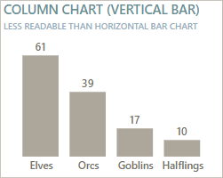</a> | __Column chart (Vertical bar)__ | The standard vertical bar chart. Harder to read compared to the horizontal version, often because the labels are truncated or angled. Consider using the Bar chart (Horizontal bar), instead.    _Subjective Goblin graph scores_  🟩🟩🟩🟩🟩 __Popularity Rating__   🟩🟩⬜⬜⬜ __Utility Rating__   ⬜⬜⬜⬜⬜ __MacGuyver Rating__ |
| <a href="bar-charts/rounded-bar-chart/">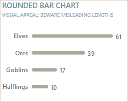</a> | __Rounded bar chart__ | A standard horizontal bar chart, except the ends are rounded. Honestly, I personally don't see the appeal, but there's a lot of people who do. There's a risk that the curves make it harder to compare lengths. It's mainly used for infographics for the shape.    _Subjective Goblin graph scores_  🟩🟩🟩⬜⬜ __Popularity Rating__   ⬜⬜⬜⬜⬜ __Utility Rating__   🟩🟩🟩⬜⬜ __MacGuyver Rating__ |
| <a href="bar-charts/stacked-bar-chart/">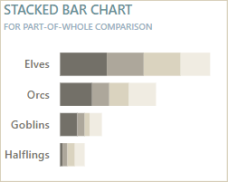</a> | __Stacked bar chart__ | The standard horizontal stacked bar chart. Can be useful because it can display both the part-of-whole and total labels, but like many part-of-whole visuals, can be difficult to read and interpret with too many categories.   _Subjective Goblin graph scores_  🟩🟩🟩🟩⬜ __Popularity Rating__   🟩🟩🟩⬜⬜ __Utility Rating__   ⬜⬜⬜⬜⬜ __MacGuyver Rating__ |
|  | __Stacked bar chart II__ | A horizontal stacked bar chart showing the percent of the total for each row (category along the Y-axis). Can be useful because it can display both the part-of-whole and total labels, but like many part-of-whole visuals, can be difficult to read and interpret with too many categories.   This is a useful chart type to analyze survey and sentiment analysis, for example.    _Subjective Goblin graph scores_  🟩🟩🟩🟩⬜ __Popularity Rating__   🟩🟩🟩⬜⬜ __Utility Rating__   ⬜⬜⬜⬜⬜ __MacGuyver Rating__ |
| <a href="bar-charts/divergent-bar-chart/">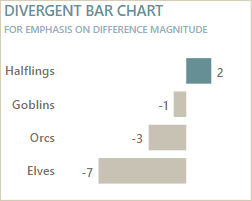</a> | __Divergent bar chart__ | A horizontal bar chart that plots the difference between two values being compared instead of showing the absolute values. This chart type is useful when you want to focus on high magnitudes of difference, or when the difference matters more than the absolute values.    _Subjective Goblin graph scores_  🟩🟩🟩🟩⬜ __Popularity Rating__   🟩🟩🟩🟩⬜ __Utility Rating__   ⬜⬜⬜⬜⬜ __MacGuyver Rating__ |
| <a href="bar-charts/lollipop/">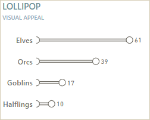</a> | __Lollipop chart__ | An alternative to the standard horizontal bar chart that has a dingle shape on the end, making it look like a lollipop. Honestly, I personally don't see the appeal, but it's especially popular if you have the data labels appear in the circle. The main use-case is if the shape of the chart needs to resemble something like a thermometer or something else.    _Subjective Goblin graph scores_  🟩🟩🟩⬜⬜ __Popularity Rating__   ⬜⬜⬜⬜⬜ __Utility Rating__   🟩🟩🟩⬜⬜ __MacGuyver Rating__ |
| <a href="bar-charts/butterfly/">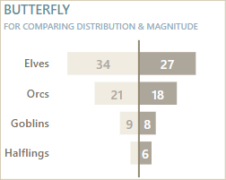</a> | __Butterfly chart__ | A type of bar chart where two series are plotted, but one is inversed. Useful for pairwise comparisons mainly of the magnitude and distribution for the values, for example when comparing two categories like sex or this year vs. last year.    _Subjective Goblin graph scores_  🟩🟩🟩⬜⬜ __Popularity Rating__   🟩🟩🟩⬜⬜ __Utility Rating__   🟩🟩⬜⬜⬜ __MacGuyver Rating__ |
| <a href="bar-charts/bar-chart-with-line-end/">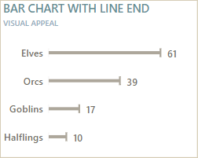</a> | __Bar chart with line end__ | A bar chart where the end has a longer line to make it easier to compare between the categories. Honestly, I wouldn't recommend doing this in Power BI because it's not worth the effort to MacGuyver and maintain it for the return you get.    _Subjective Goblin graph scores_  🟩⬜⬜⬜⬜ __Popularity Rating__   🟩🟩⬜⬜⬜ __Utility Rating__   🟩🟩🟩⬜⬜ __MacGuyver Rating__ |
| <a href="bar-charts/bullet-chart/">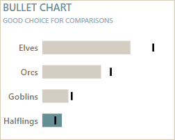</a> | __Bullet chart__ | Bullet charts are great. I love them. They are excellent chart types for comparing to a target, or between two series. In my opinion, they are the most efficient chart type for this, other than perhaps a horizontal dumbbell / connected dot plot, which sadly is not possible in Power BI right now.    _Subjective Goblin graph scores_  🟩🟩🟩🟩⬜ __Popularity Rating__   🟩🟩🟩🟩🟩 __Utility Rating__   🟩⬜⬜⬜⬜ __MacGuyver Rating__ |
|  | __Progress bar__ | A horizontal bar chart that shows a percentage completion or achievement. Note that this specific template doesn't account for overachievement (values going over 100%), which is something you should consider in addition.    _Subjective Goblin graph scores_  🟩🟩⬜⬜⬜ __Popularity Rating__   🟩🟩🟩⬜⬜ __Utility Rating__   🟩⬜⬜⬜⬜ __MacGuyver Rating__ |
| <a href="bar-charts/progress-bar-ii/">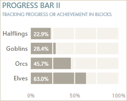</a> | __Progress bar II__ | A version of the progress bar chart that breaks the progress into discrete chunks, like 10%, 20% or 25%. This can be good if those chunks have a functional meaning, like something happens at 75-100% that wouldn't happen at 50-75%.    _Subjective Goblin graph scores_  🟩🟩🟩⬜⬜ __Popularity Rating__   🟩🟩🟩⬜⬜ __Utility Rating__   🟩🟩⬜⬜⬜ __MacGuyver Rating__ |
| <a href="bar-charts/progress-bar-iii/">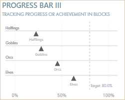</a> | __Progress bar III__ | A version of the progress bar chart that has the progress tracked as a triangle along a vertical axis. More subtle than the original and requires more MacGuyvering, as it's actually a scatterplot.    _Subjective Goblin graph scores_  🟩⬜⬜⬜⬜ __Popularity Rating__   🟩🟩⬜⬜⬜ __Utility Rating__   🟩🟩🟩🟩⬜ __MacGuyver Rating__ |
| <a href="bar-charts/progress-thin-bar/">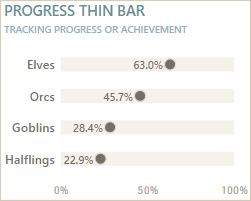</a> | __Progress thin bar__ | A version of the progress bar chart that has the progress tracked as a dot along a vertical axis; more subtle and less ink than the original. Mainly for visual appeal.    _Subjective Goblin graph scores_  🟩🟩⬜⬜⬜ __Popularity Rating__   🟩🟩⬜⬜⬜ __Utility Rating__   🟩🟩⬜⬜⬜ __MacGuyver Rating__ |
| <a href="bar-charts/bar-in-bar/">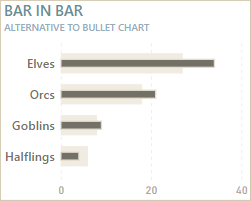</a> | __Bar-in-bar__ | Comparing two series where they are directly overlaid and one series has thinner bars than the other. This can be a nice alternative to the bullet chart and more efficient with the real estate than side-by-side bars.    _Subjective Goblin graph scores_  🟩🟩🟩⬜⬜ __Popularity Rating__   🟩🟩🟩🟩⬜ __Utility Rating__   🟩🟩⬜⬜⬜ __MacGuyver Rating__ |
| <a href="bar-charts/side-by-side-bars/">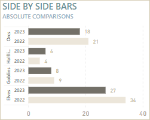</a> | __Side-by-side bars__ | Two adjacent series to compare the absolute values. In this version, the series are designed to look more like a Tableau side-by-side chart, which is sub-optimal because it's not as flexible as the core visual from Power BI.    _Subjective Goblin graph scores_  🟩🟩⬜⬜⬜ __Popularity Rating__   🟩🟩⬜⬜⬜ __Utility Rating__   🟩🟩🟩⬜⬜ __MacGuyver Rating__ |
| <a href="bar-charts/side-by-side-bars-ii/">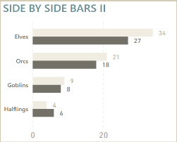</a> | __Side-by-side bars II__ | Side-by-side bars to compare two or more series. A nice, simple core visual to compare absolute values. Ensure that the minimum width is set that you can have the data labels showing.    _Subjective Goblin graph scores_  🟩🟩🟩🟩🟩 __Popularity Rating__   🟩🟩🟩⬜⬜ __Utility Rating__   ⬜⬜⬜⬜⬜ __MacGuyver Rating__ |
| <a href="bar-charts/bar-chart-candlestick/">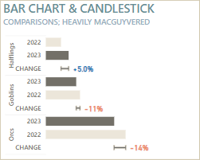</a> | __Bar chart and candlestick__ | Side-by-side bars where a candlestick shows the percentage difference. Honestly, this is a great chart type that's an alternative to connected dot plot or dumbbell charts, but in Power BI it's simply too much effort to MacGuyver with the core visuals. Just make a dumbbell / connected dot plot in Deneb or use a bullet chart; don't waste time with this.    _Subjective Goblin graph scores_  ⬜⬜⬜⬜⬜ __Popularity Rating__   🟩🟩🟩🟩⬜ __Utility Rating__   🟩🟩🟩🟩🟩 __MacGuyver Rating__ |

## Line chart templates
The following line chart templates are available:

| Image | Name | Description |
|:-----:|:----:|:------------|
| <a href="line-charts/line-chart/">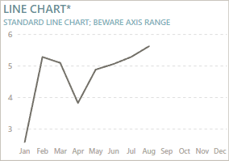</a> |__Line chart__ | The standard line chart of Power BI. Useful for plotting trends, but needs specific handling of the axes and labels to be most usable and efficient. *Beware that the Y-axis won't start at 0 by default in Power BI. Additionally, be aware that Power BI will interpolate values such that it will connect data points over blanks, which can create false trends.     _Subjective Goblin graph scores_  🟩🟩🟩🟩🟩 __Popularity Rating__ - Frequency I see it requested   🟩🟩🟩⬜⬜ __Utility Rating__ - # Different use-cases that it covers   ⬜⬜⬜⬜⬜ __MacGuyver Rating__ - Effort to make it with core visuals |
| <a href="line-charts/area-chart/">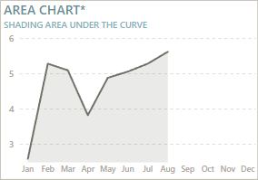</a> |__Area chart__ | The standard line chart, but with area fill beneath the line. The shaded area can help illustrate the magnitude of difference, and also improve trend readability when the chart is small.    _Subjective Goblin graph scores_  🟩🟩🟩⬜⬜ __Popularity Rating__   🟩🟩🟩⬜⬜ __Utility Rating__   ⬜⬜⬜⬜⬜ __MacGuyver Rating__ |
| <a href="line-charts/line-with-labels-and-markers/">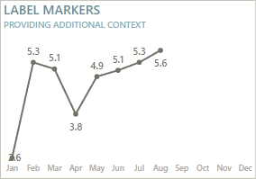</a> |__Labels and markers__ | The standard line or area chart with markers and labels. The markers should be subtle and small, and labels should be sufficiently configured to all be readable. Can sometimes provide too much context and reduce the time it takes users to read the graph.    _Subjective Goblin graph scores_  🟩🟩🟩🟩🟩 __Popularity Rating__   🟩🟩🟩⬜⬜ __Utility Rating__   ⬜⬜⬜⬜⬜ __MacGuyver Rating__ |
| <a href="line-charts/spline-chart/">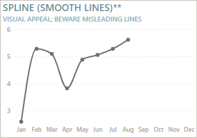</a> |__Spline line chart__ | The standard line chart but where the lines are smoothened instead of linear. While this can be aesthetically pleasing or interesting, it can create misleading trends, so be certain that you are not just using "smooth lines" for aesthetic reasons, alone.    _Subjective Goblin graph scores_  🟩🟩🟩🟩⬜ __Popularity Rating__   🟩🟩⬜⬜⬜ __Utility Rating__   ⬜⬜⬜⬜⬜ __MacGuyver Rating__ |
| <a href="line-charts/stepped-line-chart/">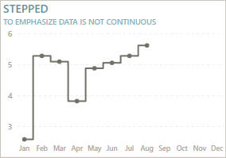</a> |__Stepped line chart__ | Shows the connections as steps instead of linear or smoothened connections. Stepped line charts help emphasize that the data is not continuous, which can be helpful.    _Subjective Goblin graph scores_  🟩⬜⬜⬜⬜ __Popularity Rating__   🟩🟩🟩⬜⬜ __Utility Rating__   ⬜⬜⬜⬜⬜ __MacGuyver Rating__ |
| <a href="line-charts/label-latest-data-point/">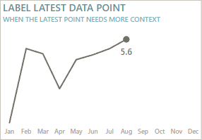</a> |__Label latest data point__ | The standard line or area chart where the latest data point is labelled. You can use this same approach to label other points-of-interest, like earliest, highest, lowest, or other points (like yesterday, last week, etc.) This helps provide additional context to the user.    _Subjective Goblin graph scores_  🟩🟩🟩🟩🟩 __Popularity Rating__   🟩🟩🟩🟩🟩 __Utility Rating__   🟩⬜⬜⬜⬜ __MacGuyver Rating__ |
| <a href="line-charts/line-with-improved-labels-and-axis-ranges/">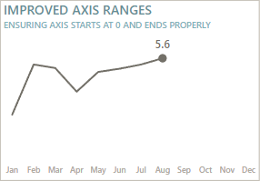</a> |__Improved axis ranges__ | The standard line or area chart where conditional formatting is used to control axis ranges to give more room for labels to render and to ensure that the axis starts at 0. This is generally recommended for most time series data, unless the emphasis is on the change (like stock market data).    _Subjective Goblin graph scores_  🟩🟩🟩🟩⬜ __Popularity Rating__   🟩🟩🟩🟩🟩 __Utility Rating__   🟩⬜⬜⬜⬜ __MacGuyver Rating__ |
| <a href="line-charts/area-of-interest-vertical/">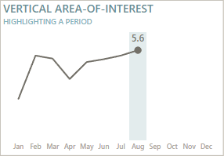</a> |__Vertical area-of-interest__ | Highlighting a specific area-of-interest on the X-axis. This can be a period or a category, depending on how the chart is set up. Requires some MacGuyvering, but is relatively stable, and useful for drawing attention.    _Subjective Goblin graph scores_  🟩🟩⬜⬜⬜ __Popularity Rating__   🟩🟩🟩🟩⬜ __Utility Rating__   🟩⬜⬜⬜⬜ __MacGuyver Rating__ |
|  |__Error bands__ | Adding error bands to the line chart to visualize data variance about a measure of central tendency like an average. Also useful for visualizing uncertainty, like for forecasting. These concepts can be advanced for many users and require data literacy training and tutorials.    _Subjective Goblin graph scores_  🟩⬜⬜⬜⬜ __Popularity Rating__   🟩🟩⬜⬜⬜ __Utility Rating__ (Situational)  ⬜⬜⬜⬜⬜ __MacGuyver Rating__ |
| <a href="line-charts/thresholds/">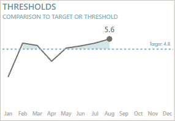</a> |__Thresholds__ | Showing a specific target or threshold and shading or marking the area above (or below) it. Useful when there is a static target or when you want to compare to a global average.    _Subjective Goblin graph scores_  🟩🟩🟩⬜⬜ __Popularity Rating__   🟩🟩🟩🟩⬜ __Utility Rating__   🟩🟩⬜⬜⬜ __MacGuyver Rating__ |
| <a href="line-charts/area-of-interest-horizontal/">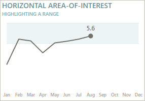</a> |__Horizontal area-of-interest__ | Highlighting a vertical area of interest, like a threshold area instead of threshold line. Also useful when you want to highlight multiple areas, like temperature ranges for machines.    _Subjective Goblin graph scores_  🟩🟩🟩⬜⬜ __Popularity Rating__   🟩🟩🟩⬜⬜ __Utility Rating__   🟩⬜⬜⬜⬜ __MacGuyver Rating__ |
|  |__Multiple lines__ | Comparing multiple series, with or without showing variation and uncertainty.    _Subjective Goblin graph scores_  🟩🟩🟩🟩🟩 __Popularity Rating__   🟩🟩🟩🟩⬜ __Utility Rating__   ⬜⬜⬜⬜⬜ __MacGuyver Rating__ |
| <a href="line-charts/hills-and-valleys/">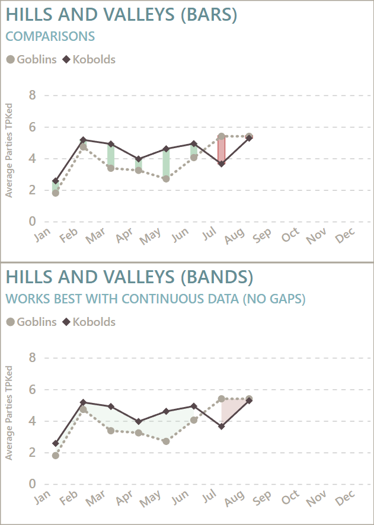</a> |__Hills and valleys__ | Comparing multiple series and highlighting the difference between them by using conditional formatting. Requires some MacGuyvering, but is quite stable. Note that the area fill cannot interpolate the area between data points, unlike the lines in the line chart.    _Subjective Goblin graph scores_  🟩🟩⬜⬜⬜ __Popularity Rating__   🟩🟩🟩🟩⬜ __Utility Rating__   🟩🟩⬜⬜⬜ __MacGuyver Rating__ |
| <a href="line-charts/multiple-area/">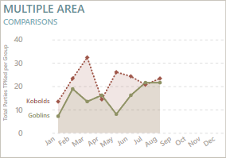</a> |__Multiple area__ | Comparing multiple series where there are overlapping area fills between the lines. Can be useful circumstantially but can also pollute the canvas with additional ink that doesn't need to be there.    _Subjective Goblin graph scores_  🟩🟩🟩🟩⬜ __Popularity Rating__   🟩🟩🟩⬜⬜ __Utility Rating__   ⬜⬜⬜⬜⬜ __MacGuyver Rating__ |
| <a href="line-charts/stacked-area/">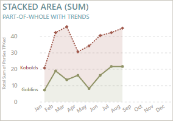</a> |__Stacked area__ | Parts-of-whole for trend analysis. Useful when you want to break up a trend to see how different parts contribute to a total. Need to be careful that it isn't mis-interpreted by users.    _Subjective Goblin graph scores_  🟩🟩🟩⬜⬜ __Popularity Rating__   🟩🟩🟩⬜⬜ __Utility Rating__   ⬜⬜⬜⬜⬜ __MacGuyver Rating__ |

## KPI and card templates
The following KPI and card templates are available:

*Note: TOC table to be added later, when I get time.*

### Core visuals - no SVG measures
These use the formatting options of the core visuals like cards, tables, etc. to achieve a KPI or callout-like effect.

.png>)

### Core visuals - SVG measures
These use a combination of formatting options as well as SVG custom microvisualizations rendered as image URLs in the core visuals. 

**These SVG measure templates were created by Štěpán Rešl.**

.png>)

## Remark
I don't consider myself a "dataviz person"; these comments are my subjective opinions and experience. I'm just sharing these templates because they might be helpful to others.