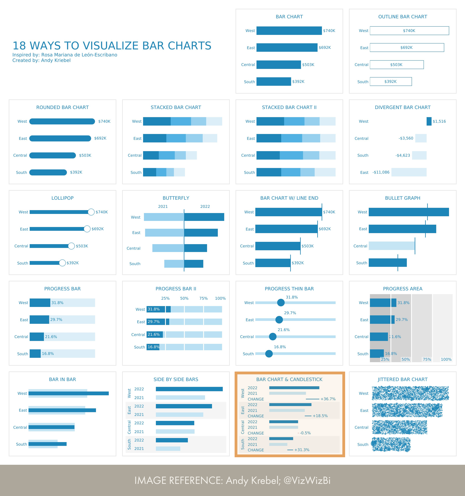

# Bar chart and candlestick
An bar chart with candlestick is _technically_ possible with the core visuals of Power BI, however it requires a huge amount of report-specific objects and Macguyvering effort..

__Reference:__ [Andy Krebel; @VizWizBi](https://twitter.com/VizWizBI/status/1683771982410665985)

## Limitations
There are some limitations to this Macguyvered implementation.

1. There are too many report-specific objects required.
2. Axis sorting doesn't always work.
3. The X-axis maximum is hard-coded.

## Considerations
Instead, consider creating this visual using Deneb or finding another way to express comparisons between actual and target, like a bullet chart.

## Alternatives
An alternative approach to create this visual in Power BI is by using the [Deneb custom visual](https://deneb-viz.github.io/).