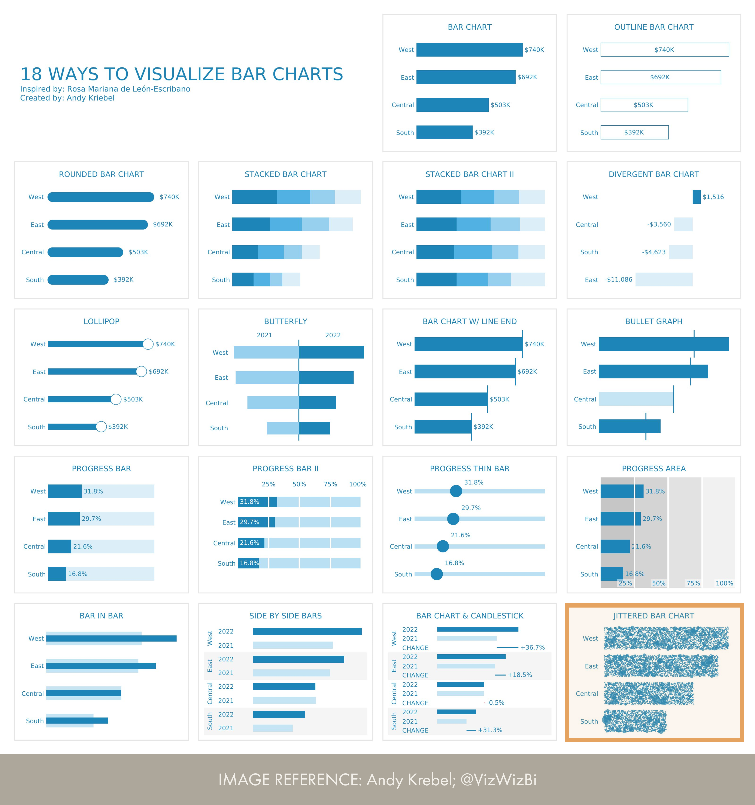

# Jittered bar chart
An jittered bar chart is _technically_ possible with the core visuals of Power BI by using a scatterplot. However, the return of this effort is not even worth creating the template, in my opinion. Instead, you should just opt for one of the many [jittered scatter / swarm](https://kerrykolosko.com/portfolio/categorical-jittered-scatter-mean-overlay/) or [raincloud](https://kerrykolosko.com/portfolio/raincloud-labelled/) Deneb templates that exist to better visualize data distribution together with a measure of central tendency.

__Reference:__ [Andy Krebel; @VizWizBi](https://twitter.com/VizWizBI/status/1683771982410665985)

## Blocking points
In order to create this visual with the core Power BI visuals, the following formatting options are required:

1. Show raw data points.
2. Dynamically adjust the size.

## Alternatives
An alternative approach to create this visual in Power BI is by using the [Deneb custom visual](https://deneb-viz.github.io/).

1. [Raincloud template by Kerry Kolosko](https://kerrykolosko.com/portfolio/raincloud-labelled/)
2. [Jittered Scatter Mean Overlay by Kerry Kolosko](https://kerrykolosko.com/portfolio/categorical-jittered-scatter-mean-overlay/)