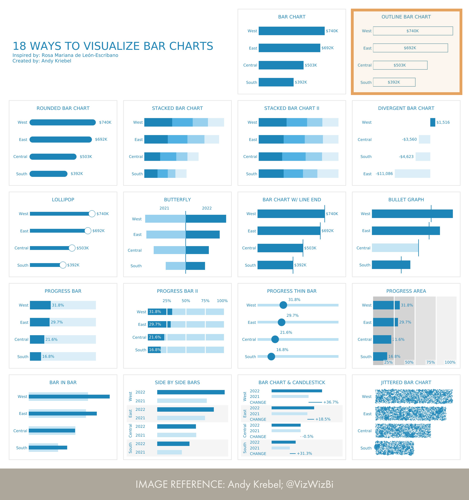

# Outline Bar Chart
An outline bar chart is currently not possible with the core visuals of Power BI. 

__Reference:__ [Andy Krebel; @VizWizBi](https://twitter.com/VizWizBI/status/1683771982410665985)

## Blocking points
In order to create this visual with the core Power BI visuals, the following formatting options are required:

1. Stroke width and color for data bars.
2. (Optional) Transparency control for data bar fill.

## Alternatives
An alternative approach to create this visual in Power BI is by using the [Deneb custom visual](https://deneb-viz.github.io/). You should know how to use [pattern fills](https://deneb-viz.github.io/pattern-fills) and other basic formatting options of Vega. Consider [this relevant tutorial by Power BI Guy](https://www.youtube.com/watch?v=HBQAi_0gR2c). Below are some templates:

1. [Simple Fixed Height Bar by Kerry Kolosko](https://kerrykolosko.com/portfolio/simple-fixed-height-bar/): A good template to get you started. Just adjust the formatting.