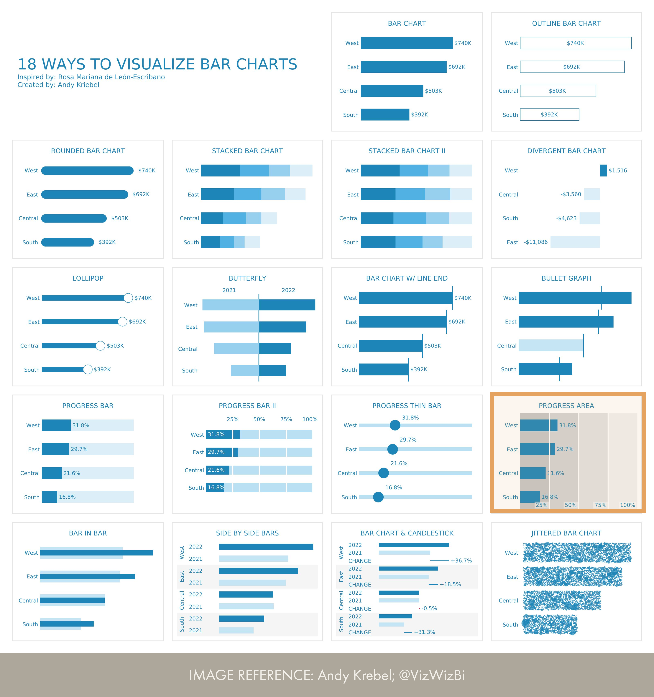

# Progress area
A progress area chart is currently not possible with the core visuals of Power BI. 

__Reference:__ [Andy Krebel; @VizWizBi](https://twitter.com/VizWizBI/status/1683771982410665985)

## Blocking points
In order to create this visual with the core Power BI visuals, the following formatting options are required:

1. Fill under curve (under reference lines) for constant lines
2. (Optional) Other additional formatting options for (formerly) "analytics pane" features

## Alternatives
An alternative approach to create this visual in Power BI is by using the [Deneb custom visual](https://deneb-viz.github.io/). You will likely need to create a [layered plot](https://vega.github.io/vega-lite/examples/#other-layered-plots).