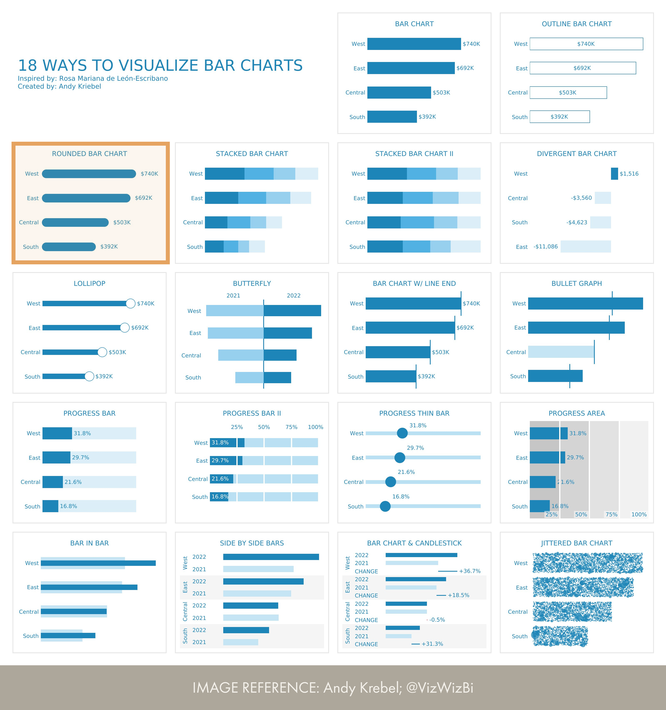

# Rounded Bar Chart
An rounded bar chart has some key considerations and limitations. 

__Reference:__ [Andy Krebel; @VizWizBi](https://twitter.com/VizWizBI/status/1683771982410665985)

## Limitations
The rounded bar chart has several limitations with core visuals in Power BI:

1. Width cannot exceed 10px (Error Bar width limit)
2. Axes may need adjusting for certain ranges
3. Marker edge renders beyond the actual value (potential for misleading visual)

## Considerations
Consider using a normal bar chart, instead. Honestly, why do you need rounded corners?

## Alternatives
An alternative approach to create this visual in Power BI is by using the [Deneb custom visual](https://deneb-viz.github.io/). See [this template](https://vega.github.io/vega-lite/docs/bar.html#bar-chart-with-rounded-corners) from the Vega-lite docs.