These C# scripts add SVG visuals to your semantic model with Tabular Editor.
- The objective is to make it easier and more accessible for people to use SVG microvisualizations.
- There are ~30 templates provided at first, but more will follow.
- If you want your SVG template converted to a C# script, please reach out to me (Kurt Buhler) to convert it.

You can use these scripts and templates for free for non-commercial use. I'd appreciate that you please cite [data-goblins.com](https://www.data-goblins.com) if you do. For any future templates originally authored by someone else, please cite the original author.

## Were these scripts helpful to you? 
I don't accept donations, have a patreon, or sell anything, but if you want to donate time helping me to prepare my tabletop roleplaying game campaign, that'd be great. So if you like worldbuilding or want to just have a 1 hour call with me to ideate about one of my tRPG sessions, that's payment enough for me 🎲.

## ⚠️ Notice
These templates are provided as-is without warranties or guarantees. They are not maintained nor are they all necessarily suitable for use in production solutions.

Feel free to use them, but do so at your own risk.

## 💡 To use these templates
To use these templates, you must first download and install [Tabular Editor 2 (Open Source)](https://docs.tabulareditor.com/te2/Getting-Started.html) or [Tabular Editor 3](https://tabulareditor.com/downloads).

Then, proceed as follows:
1. Find the chart you want to add and copy the script to your clipboard.
2. In Tabular Editor, select a table in the TOM Explorer and paste the script in the C# Script or Advanced Scripting window.
3. Run the script and select the appropriate fields. Only unhidden fields can be selected.
4. After creating the measure, validate the DAX and SVG specification for errors. If necessary, adjust it yourself by i.e. changing colors or adding additional columns to group by.
5. In the Power BI report connected to the model, add the measure to a new table visual together with the column you selected to group the data.
6. In the Formatting Pane for the table, set the Image size property to 'Height' of 25px and 'Width' of 100px. 
7. Test the measure to ensure good performance and expected results. If necessary, modify the DAX or SVG specification, but test thoroughly before using.

## Overview of Provided Templates

An overview of all the templates are listed below. Click the image to navigate to the script and use it in your model.

### Bar charts

| Image (Click for Template) | Name | Description |
|:--------------------------:|:----:|:------------|
|  | __Bar chart__ | Standard bar where you can control color, height, etc. |
| <a href="bar-chart/rounded-corners/add-svg-bar-chart-rounded-corners-standard.csx">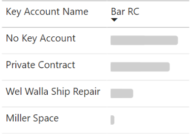</a> | __Bar chart (Rounded corners)__ | Standard bar with round corners. |
| <a href="bar-chart/rounded-tops/add-svg-bar-chart-rounded-tops-standard.csx">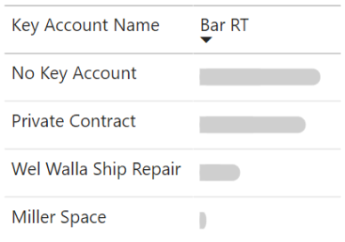</a> | __Bar chart (Rounded tops)__ | Fully rounded bar chart. |
| <a href="bar-chart/standard/add-svg-bar-chart-labelled.csx">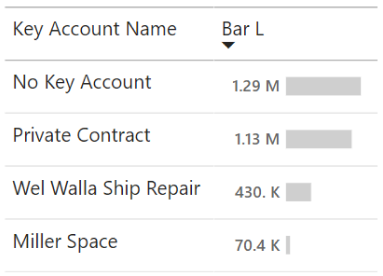</a> | __Bar chart (With label)__ | Standard bar where you can control color, height, etc. |
| <a href="bar-chart/rounded-corners/add-svg-bar-chart-rounded-corners-labelled.csx">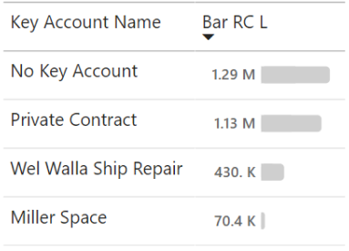</a> | __Bar chart (Rounded corners with label)__ | Standard bar with round corners. |
| <a href="bar-chart/rounded-tops/add-svg-bar-chart-rounded-tops-labelled.csx">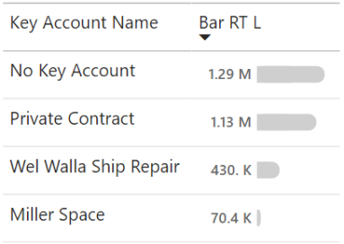</a> | __Bar chart (Rounded tops with label)__ | Fully rounded bar chart. |
| <a href="bar-chart/standard/add-svg-bar-chart-conditional-formatting.csx">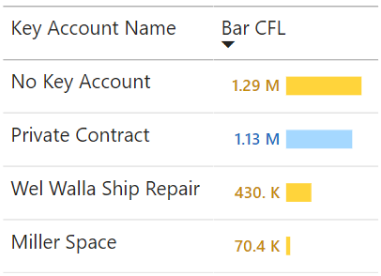</a> | __Bar chart (With label and CF)__ | Bar with conditional formatting and label. |
| <a href="bar-chart/rounded-corners/add-svg-bar-chart-rounded-corners-conditional-formatting.csx">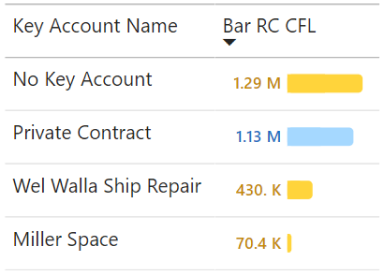</a> | __Bar chart (Rounded corners with label and CF)__ | Standard bar with round corners, conditional formatting, and label. |
| <a href="bar-chart/rounded-tops/add-svg-bar-chart-rounded-tops-conditional-formatting.csx">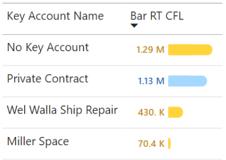</a> | __Bar chart (Rounded tops with label and CF)__ | Fully rounded bar chart with conditional formatting and label. |
| <a href="bar-chart/add-svg-bar-chart-adjacent-bars-with-variance.csx">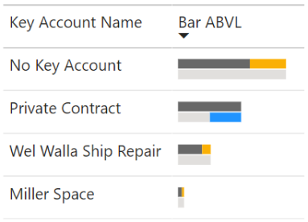</a> | __Bar chart (Adjacent with variance)__ | Actual and target next to one another, with variance on top of the lower bar. |
| <a href="bar-chart/add-svg-bar-chart-overlapping-bars-with-variance.csx">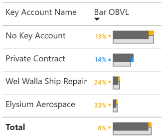</a> | __Bar chart (Overlapping with variance)__ | Actual and target ontop of one another, with variance on top of the lower bar and a label. |
| <a href="bar-chart/add-svg-diverging-bar-chart.csx">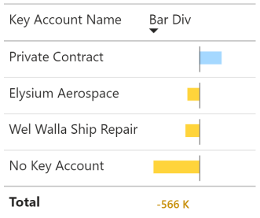</a> | __Bar chart (Diverging)__ | Plots the difference between actual and target in bar width. Total shows the label only. |

### Bullet charts

| Image (Click for Template) | Name | Description |
|:--------------------------:|:----:|:------------|
| <a href="bullet-chart/add-svg-bullet-chart-label.csx">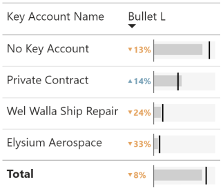</a> | __Bullet chart (With label)__ | Simple bullet chart with label and no bar CF or qualitative ranges. |
| <a href="bullet-chart/add-svg-bullet-chart-conditional-bar.csx">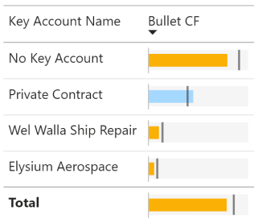</a> | __Bullet chart (Conditional formatting)__ | Simple bullet chart with conditional formatting and no label or qualitative ranges. |
| <a href="bullet-chart/add-svg-bullet-chart-qualitative-ranges.csx">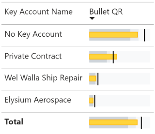</a> | __Bullet chart (Qualitative ranges)__ | Simple bullet chart with bar and qualitative ranges. |
| <a href="bullet-chart/add-svg-bullet-chart-label-and-qualitative-ranges.csx">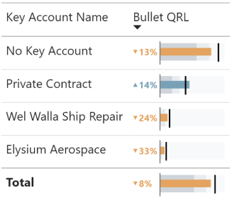</a> | __Bullet chart (QR, Label, CF)__ | Bullet chart with QR, label, and conditional formatting. |
| <a href="bullet-chart/add-svg-bullet-chart-action-dots.csx">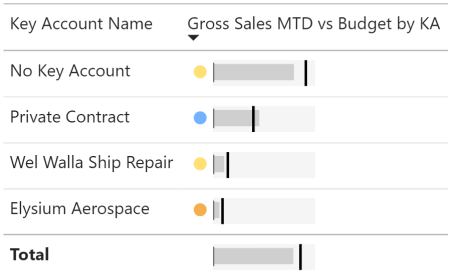</a> | __Bullet chart (Action dots)__ | Advanced bullet that has conditional action dots adjacent to the chart. |
| <a href="bullet-chart/add-svg-bullet-chart-multiple-target-with-action-dots.csx">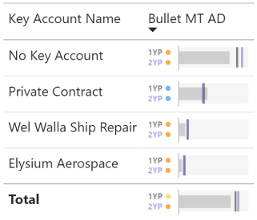</a> | __Bullet chart (Multi-target)__ | Advanced bullet chart that supports comparing to two targets. |

### Lollipop charts

| Image (Click for Template) | Name | Description |
|:--------------------------:|:----:|:------------|
|  | __Lollipop Chart (with label)__ | Plots the value as a line and ends with a conditionally sized dot. |
| <a href="lollipop-chart/add-svg-lollipop-chart-conditional-formatting.csx">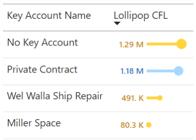</a> | __Lollipop chart (Conditional formatting)__ | Plots the value as a line and ends with a conditionally sized dot. Supports CF vs target. |

### Dumbbell plots

| Image (Click for Template) | Name | Description |
|:--------------------------:|:----:|:------------|
| <a href="dumbbell-plot/add-svg-dumbbell-plot.csx">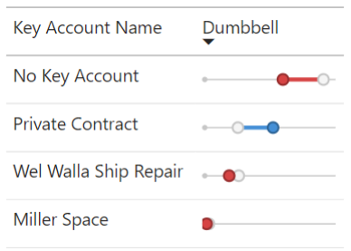</a> | __Dumbbell plot__ | Plots actual and target as dots and draws a line between them with CF. |

### Waterfall charts

| Image (Click for Template) | Name | Description |
|:--------------------------:|:----:|:------------|
| <a href="waterfall-chart/add-svg-waterfall-chart.csx">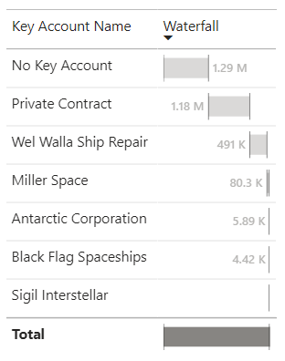</a> | __Waterfall chart (simple)__ | Simple horizontal waterfall for a single category. Doesn't support breakdowns within category. |

### Distribution charts

| Image (Click for Template) | Name | Description |
|:--------------------------:|:----:|:------------|
| <a href="jitter-plot/add-svg-jitter-plot-single-category.csx">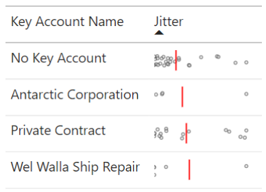</a> | __Jitter plot__ *(modified from <a href="https://kerrykolosko.com/portfolio/barcode-jitter-scatter/"> Kerry Kolosko </a>)* | Shows distribution of points along an X-axis with random jitter so points are visible. Includes average line.  Warning: Limited data points supported. |

### Text and callouts

| Image (Click for Template) | Name | Description |
|:--------------------------:|:----:|:------------|
| <a href="text-and-callouts/add-svg-status-pill.csx">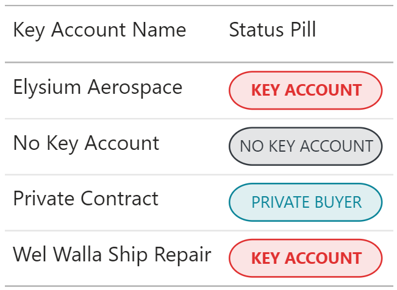</a> | __Callout / Status Pill__ | Uses special formatting to call out a text value from a column. |